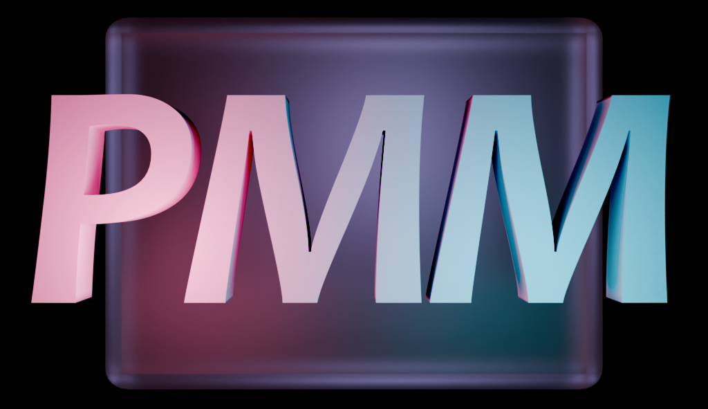
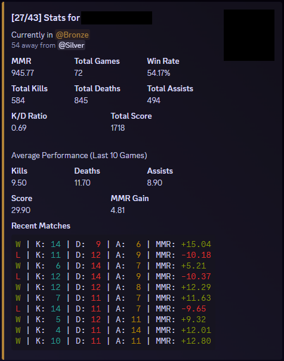
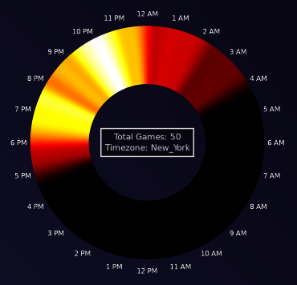
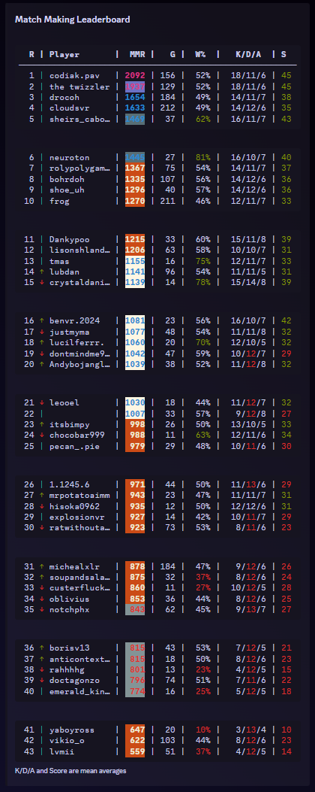
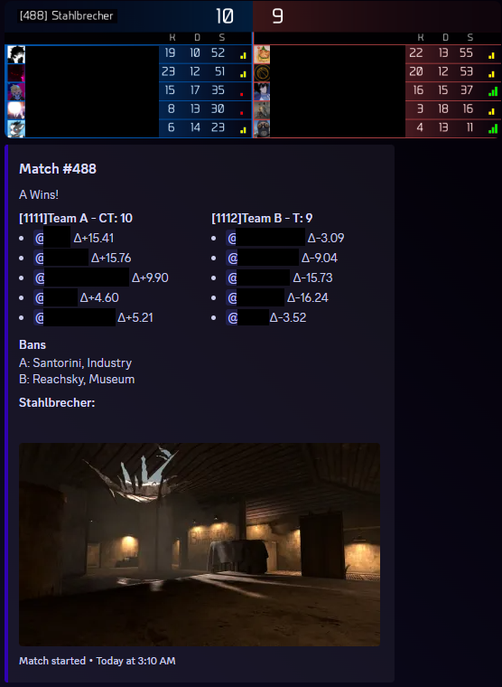

# VALORS Match Making Bot

A Discord-powered Match Making server for Pavlov VR with automated team formation, voting, and performance tracking.

 

## Features

### Queue Management
- Flexible queue joining with pingable role
- Automated team formation
- Interactive map voting and team side selection

### Performance Tracking
- Comprehensive player statistics
- Performance history visualization

- Activity tracking and analysis

### Community Features
- Competitive leaderboards

- Match history and scoreboards

- Steam account integration for in-game performance tracking

### Server Management
- Automated game server management
- Custom ELO calculation system taking into account personal past and current performance
- Comprehensive moderation tools:
  - Multiple warning types
  - Timeout functionality
  - User blocking
  - Member infraction tracking
- State system allows live updates of the bot
- On the fly configuration of queue, match settings, map-pool, and more

## Setup
- Deployed with VALORS-Bot-API's docker-compose.yaml configuration

## API Integration
This bot requires the [VALORS-Bot-API](https://github.com/99oblivius/VALORS-Bot-API) for full functionality.

## Contributing
I am open for any and all feedback. Feel free to create Pull requests.
